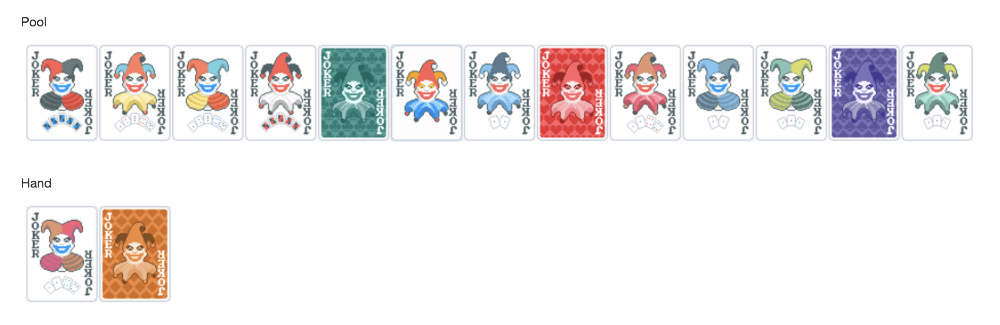

# not-balatro

<!-- badges: start -->

<!-- badges: end -->

A test of [the {sortable} package](https://rstudio.github.io/sortable/) to see how pliable it is to play card games with R using [{shiny} apps](https://shiny.posit.co/). Specifically, clicking and dragging 'cards' from a pool into your hand and then calculating a score given your selections.

[Available on the web](https://matt-dray.github.io/not-balatro/) and prepared for serverless deployment with [{shinylive}](https://posit-dev.github.io/r-shinylive/). Very much a work in progress/proof of concept.

Currently using jokers from the excellent [Balatro by Localthunk](https://www.playbalatro.com/). Images from the [Balatro Fandom wiki](https://balatrogame.fandom.com/wiki/Jokers#List_of_Jokers).

